**Engenharia de Software – Católica SC**

---

# Identificação

- **Título do Projeto:**  
  Gatherly.

- **Linha de Projeto (Direction):**  
  Web

- **Autor:**  
  Gustavo Mafra Paluski

- **Data da Proposta:**  
  12/04/2026

- **Versão:**  
  1.0

---

# 1. Visão do Produto e Impacto (O Problema)

## 1.1 Contexto e Problema

O projeto tem como objetivo resolver um problema real relacionado à dificuldade de conexão entre pessoas em eventos presenciais e sociais. Atualmente, se tem visto programações informais, seja praticar algum esporte entre amigos, encontros ou atividades em grupo, serem canceladas por falta de participantes suficientes, causando o cancelamento da atividade.

Além disso, existem pessoas que se mudam para outras cidades ou que possuem poucas amizades, que enfrentam dificuldades em encontrar oportunidades de socialização e de encontros entre pessoas. A ausência de uma plataforma centralizada que facilite a descoberta e participação em eventos locais contribui para esse cenário.

Atualmente esses problemas são resolvidos através de grupos em redes sociais ou em recomendações de amigos, fazendo com que os interessados tenham que estar em diversos grupos e ter instalado vários aplicativos de redes sociais para confirmar por mensagem que irá participar dos encontros e eventos, tendo a possibilidade dessa mensagem se perder, dificultando o trabalho dos organizadores.

Exemplo:

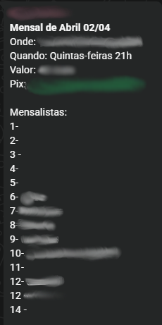

IMAGEM  01 - FOTO DE MENSAGEM COM AS LISTAS DOS CONFIRMADOS PARA UMA PARTIDA DE FUTEBOL.   

Com isso, o projeto não se limita a um desafio técnico, mas busca atender a uma necessidade real, de facilitar a organização, descoberta e participação em eventos, promovendo a conexão entre pessoas nas suas localidades.  

---

## 1.2 Origem da Demanda e Evidências

A fim de validar a relevância do projeto e descobrir as dores latentes, foi conduzida uma pesquisa, via formulário eletrônico, para identificar lacunas na criação de eventos informais entre amigos, colegas e entre pessoas desconhecidas.

A pesquisa continha perguntas sobre como era a dificuldade do entrevistado em criar e participar de eventos, sendo por meios externos ou pessoais, e como um sistema iria ajudar a diminuir ou amenizar esse problema.

Ao todo, 19 (dezenove) pessoas responderam ao formulário. Os resultados, como mostra a imagem abaixo, indicam que as principais dificuldades estão relacionadas à desistência de participantes (47,4%) e à dificuldade de atingir o número mínimo de pessoas necessárias para a realização do evento (31,6%).

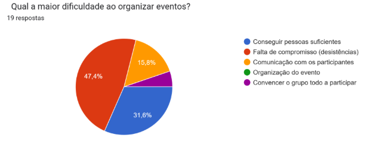

IMAGEM 02 - GRÁFICO MOSTRANDO AS MAIORES DIFICULDADES AO ORGANIZAR EVENTOS 

Além disso, a pesquisa demonstra que existe um possível interesse de uso da plataforma pelos usuários, onde 78,9% dos entrevistados responderam que usariam o novo sistema proposto.

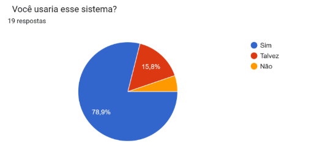

IMAGEM 03 - GRÁFICO MOSTRANDO COMO SÃO MARCADOS OS EVENTOS ATUALMENTE

Esses dados evidenciam que há uma dor recorrente na organização de eventos informais, especialmente no que diz respeito à previsibilidade de participação e à formação de grupos. Tais dificuldades reforçam a necessidade de uma solução que facilite a descoberta de participantes e aumente o engajamento, validando a proposta do projeto.

## 1.3 Análise de Soluções Existentes (Benchmark)

<h2>Meetup</h2>

O Meetup é uma plataforma voltada à criação e participação em eventos baseados em interesses em comum, organizados principalmente por grupos temáticos. Seu principal objetivo é promover conexões sociais e profissionais por meio de encontros presenciais ou online.

IMAGEM 04 - IMAGEM DA PLATAFORMA "MEETUP"

Link: https://www.meetup.com/pt-BR/

**Público-alvo**:
Pessoas que querem se conectar com outras por meio de interesses em comum

**Funcionalidades principais**: 
- Criação e descoberta de eventos;
- Organização por grupos de interesse;
- Confirmação de presença (RSVP);
- Interação entre usuários.

<h3>Eventbrite</h3>

O Eventbrite é uma plataforma voltada à criação, gestão e comercialização de eventos, oferecendo recursos como venda de ingressos, controle de participantes e ferramentas de divulgação. Seu foco está em eventos estruturados e de maior escala, como shows e conferências. No entanto, apresenta limitações em cenários informais e dinâmicos, especialmente aqueles que exigem rápida organização e participação espontânea.

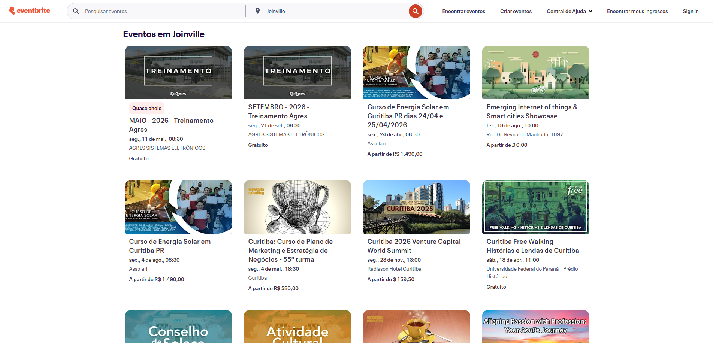

IMAGEM 05 - IMAGEM DA PLATAFORMA "Eventbrite"

Link: https://www.eventbrite.com.br/

**Público-alvo**: 
Participantes em busca de eventos e organizadores de eventos que buscam criar, divulgar e monetizar experiências.

**Funcionalidades principais**: 
- Criação e descoberta de eventos;
- Venda e gestão de ingressos;
- Pagamentos integrados (compras direto pelo app);
- Check-in de validação;
- Painel para organizadores.

<h3>Fubles</h3>

O Fubles é uma plataforma voltada à organização de partidas informais de futebol, permitindo a criação de jogos e a participação aberta de jogadores para completar equipes. A solução atende diretamente ao problema de formação de grupos em atividades esportivas, porém é limitada a um nicho específico, não contemplando outros tipos de eventos sociais.

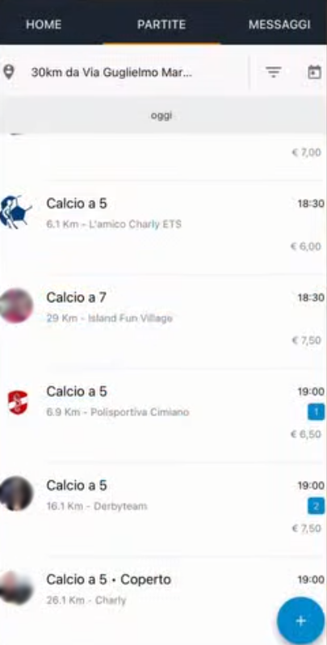

IMAGEM 06 - IMAGEM DA PLATAFORMA "Fubles"

Link: https://www.fubles.com/pt/

**Público-alvo**: 
Pessoas que jogam futebol amador ou profissional, como foco em jogar por lazer

**Funcionalidades principais**: 
- Criação de partidas;
- Entrada em partidas;
- Sistema de avaliação;
- Comunicação

## Comparação
| Solução   | Pontos fortes                                                                 | Limitações                                                                                  |
|-----------|------------------------------------------------------------------------------|---------------------------------------------------------------------------------------------|
| Meetup    | Forte na descoberta de eventos;   Organização por grupos de interesse;   Facilita networking e socialização;   Boa base de usuários. | Foco em eventos planejados;   Pouca eficiência para eventos de última hora;   Baixa dinamicidade na entrada de participantes;   Sistema de reputação limitado. |
| Eventbrite| Criação e gestão robusta de eventos;   Sistema completo de venda de ingressos;   Ferramentas de divulgação e análise;   Alta escalabilidade | Voltado a eventos formais e pagos;   Pouca interação social entre participantes;   Não atende bem eventos informais;   Baixa flexibilidade para eventos espontâneos |
| Fubles    | Entrada aberta de participantes;   Resolve o problema de completar vagas;   Sistema de avaliação de usuários;   Simples e direto | Restrito ao futebol;   Não abrange outros tipos de eventos;   Pouco foco em socialização geral;   Baixa flexibilidade de uso |
| Gatherly  | Foco em eventos informais e espontâneos;   Aplicável a diversos tipos de eventos;   Sistema de avaliação de usuários | Dependência de uma base inicial de usuários ativa para garantir a criação e participação em eventos;   Necessidade de gerar confiança entre usuários;   Ainda sem validação em larga escala |

---

### Diferencial do Projeto

O principal diferencial do projeto está na proposta de integrar, em uma única plataforma, a criação de eventos informais, a participação dinâmica de usuários e a conexão social entre pessoas, com foco em situações do cotidiano.

Diferentemente das outras soluções existentes, que são focados em eventos pagos ou de um nicho muito específico, como os que possuem foco apenas em futebol, esse projeto busca que os usuários possam realizar e participar de eventos espontâneos e de baixa formalidade, permitindo criarem atividades de forma rápida e encontrem participantes em tempo real.

Além disso, a plataforma permite a participação de usuários em eventos organizados tanto por conhecidos quanto por desconhecidos, ajudando a reduzir problemas recorrentes, como o cancelamento de atividades devido à falta de participantes suficientes. E, para ajudar na segurança, ela também possui um sistema de avaliação de usuário, permitindo verificar um pouco das características dos confirmados.

Dessa forma, o projeto se diferencia ao oferecer uma solução que não foca apenas em eventos e temas específicos, mas sim ao cotidiano dos usuários, fortalecendo as interações sociais e as organizações dessas atividades.

---

## 1.4 Público-Alvo

O projeto possui 2 públicos alvos possíveis, o participante e o organizador do evento.

O participante pode ser qualquer pessoa que estiver logada no sistema, podendo visualizar e participar de eventos que ela escolher.

Assim como o participante, o organizador também pode ser qualquer pessoa, onde é possível criar seus eventos com informações para que os participantes possam acompanhar e entender o que está sendo criado.

A plataforma foi pensada para ser acessível e intuitiva, não exigindo conhecimentos técnicos prévios, para assim, facilitar a adesão e utilização por diferentes perfis de usuários.

---

## 1.5 Objetivos do Projeto

### Objetivo Geral

O principal objetivo do projeto é acabar com a dificuldade de organizar e criar atividades e eventos informais por falta de participantes, assim como também ajudar pessoas com dificuldade de socialização e novatos nas cidades a encontrarem atividades de lazer do dia a dia com pessoas que não são do mesmo convívio, criando novas amizades e experiências.

---

### Objetivos Específicos

- Permitir a criação e gerenciamento de eventos informais de forma simples e rápida;
- Facilitar a descoberta de eventos com base em localização e interesse dos usuários;
- Possibilitar a participação dinâmica em eventos, com controle de vagas disponíveis;
- Implementar um sistema de avaliação de usuários para aumentar a confiança nas interações;
- Promover a conexão social entre pessoas por meio de atividades presenciais.

---

## 1.6 Métricas de Sucesso (KPIs)

- Tempo médio de resposta inferior a 3000ms nas principais operações;
- Suporte a pelo menos 50 usuários simultâneos sem degradação significativa de desempenho;
- Pelo menos 70% dos eventos criados atingirem o número mínimo de participantes;
- Taxa de participação em eventos superior a 60% dos usuários cadastrados;
- Média de avaliação dos usuários igual ou superior a 4 (em uma escala de 1 a 5).

---

# 2. Engenharia de Requisitos

## 2.1 Personas

## Persona 1 — O Organizador Frustrado

**Nome:** Lucas Andrade

**Idade:** 24 anos

**Contexto:**

Lucas mora em uma cidade de médio porte e gosta de organizar partidas de futebol com amigos. Ele costuma criar grupos no WhatsApp, mas frequentemente tem dificuldades para fechar o número de jogadores.

**Objetivos:**

- Conseguir completar times com facilidade
- Organizar eventos de forma rápida
- Evitar cancelamentos de última hora

**Principais dificuldades:**

- Pessoas desmarcam em cima da hora
- Falta de jogadores suficientes
- Organização bagunçada em grupos de mensagem
- Dificuldade de alcançar novas pessoas fora do círculo de amigos

## Persona 2 — O Participante Interessado

**Nome:** Ana Maria

**Idade:** 22 anos

**Contexto:**

Ana é nova na cidade em que reside, não tem amigos, conhecidos e nem familiares por perto. Ela gosta de fazer caminhadas e exercícios físicos com pelo menos uma pessoa, porém não conhece ninguém para participar com ela, querendo buscar novas amizades para realizar tais atividades.

**Objetivos:**

- Conseguir novas amizades
- Encontrar pessoas procurando por companhia para caminhadas

**Principais dificuldades:**

- Não ter pessoas conhecidas por perto
- Medo de entrar em grupos desconhecidos
- Não conhecer os lugares da cidades para realizar as atividades

## Persona 3 — O Usuário Cauteloso

**Nome:** Rafael Lima

**Idade:** 28 anos

**Contexto:**

Rafael gosta de esportes e eventos sociais, mas já teve experiências ruins com grupos desorganizados e pessoas irresponsáveis.

**Objetivos:**

- Participar de eventos confiáveis
- Evitar experiências negativas
- Garantir segurança e organização

**Principais dificuldades:**

- Falta de confiança nos participantes
- Eventos mal organizados
- Falta de avaliação/reputação dos usuários
- Medo de perder tempo com eventos ruins

---

## 2.2 Casos de Uso Principais

### Caso de Uso: Criar Evento

#### Objetivo
Permitir que organizadores criem eventos na plataforma.

#### Atores
Organizador.

#### Fluxo Principal
1. O organizador acessa a área de criação de eventos;
2. O sistema exibe o formulário de cadastro;
3. O organizador informa os dados do evento;
4. O sistema valida as informações;
5. O evento é publicado na plataforma.
 
 
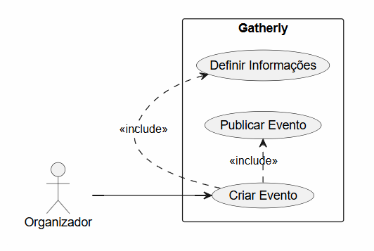

---

### Caso de Uso: Participar de Evento

#### Objetivo
Permitir que participantes se inscrevam em eventos disponíveis.

#### Atores
Participante.

#### Fluxo Principal
1. O participante acessa a lista de eventos;
2. O sistema exibe os eventos disponíveis;
3. O participante seleciona um evento;
4. O sistema exibe os detalhes do evento;
5. O participante realiza sua inscrição;

 
 
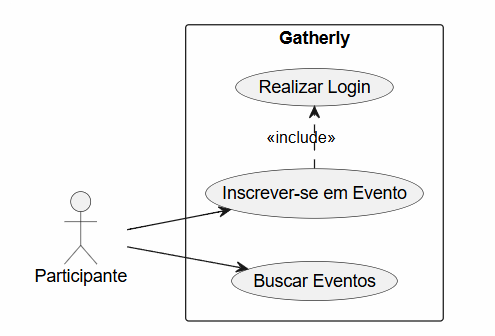

---

### Caso de Uso: Conversar no Chat do Evento

#### Objetivo
Permitir a interação entre participantes inscritos em um evento.

#### Atores
Participante.

#### Fluxo Principal
1. O participante acessa o evento inscrito;
2. O sistema libera acesso ao chat;
3. O participante envia mensagens;
4. O sistema distribui as mensagens em tempo real para os demais participantes.

 
 
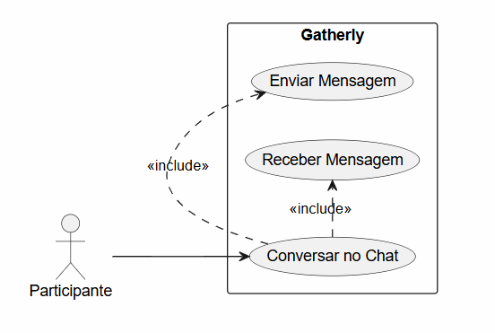

---

### Caso de Uso: Denunciar Usuário ou Evento

#### Objetivo
Permitir que usuários denunciem comportamentos ou conteúdos inadequados.

#### Atores
Participante.

#### Fluxo Principal
1. O participante acessa o perfil do usuário ou evento;
2. O participante seleciona a opção de denúncia;
3. O sistema solicita o motivo da denúncia;
4. A denúncia é registrada;
5. O administrador analisa a ocorrência.

 
 
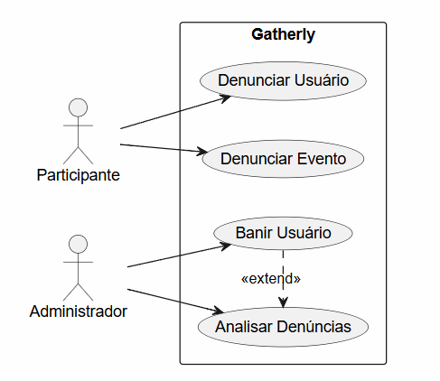

---

### Caso de Uso: Avaliar Usuários

#### Objetivo
Permitir que participantes avaliem outros usuários após a participação em eventos.

#### Atores
Participante.

#### Fluxo Principal
1. O participante acessa o histórico de eventos;
2. O sistema exibe os participantes do evento;
3. O usuário seleciona um participante;
4. O sistema permite registrar uma avaliação;
5. A avaliação é armazenada na plataforma.

 
 
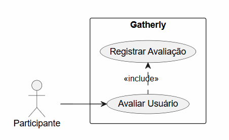

---

## 2.3 Requisitos Funcionais (RF)

RF01 – O sistema deve permitir que usuários realizem cadastro utilizando nome, e-mail, senha e informações básicas de perfil.

RF02 – O sistema deve permitir que usuários autenticados realizem login utilizando e-mail e senha.

RF03 – O sistema deve permitir que usuários editem informações do perfil, como foto, descrição, interesses e cidade.

RF04 – O sistema deve permitir que usuários criem eventos informais contendo título, descrição, data, horário, local, categoria e limite de participantes.

RF05 – O sistema deve permitir que o organizador edite informações de eventos criados.

RF06 – O sistema deve permitir que o organizador exclua eventos criados.

RF07 – O sistema deve permitir que usuários visualizem eventos disponíveis na plataforma.

RF08 – O sistema deve permitir que usuários pesquisem eventos por nome, categoria ou cidade.

RF09 – O sistema deve permitir que usuários filtrem eventos por categoria, data, localização e quantidade de vagas.

RF10 – O sistema deve permitir que usuários confirmem participação em eventos.

RF11 – O sistema deve permitir que usuários cancelem participação em eventos antes de sua realização.

RF12 – O sistema deve impedir novas participações quando o limite máximo de participantes for atingido.

RF13 – O sistema deve permitir que o organizador visualize a lista de participantes do evento.

RF14 – O sistema deve disponibilizar um chat para comunicação entre participantes de um mesmo evento.

RF15 – O sistema deve enviar notificações relacionadas a eventos, como confirmação de participação, cancelamentos e alterações.

RF16 – O sistema deve permitir que usuários denunciem outros usuários por comportamento inadequado.

RF17 – O sistema deve permitir que usuários denunciem eventos considerados inadequados.

RF18 – O sistema deve permitir que administradores analisem denúncias e realizem ações de moderação.

RF19 – O sistema deve permitir que organizadores cancelem eventos.

RF20 – O sistema deve permitir que usuários visualizem eventos passados dos quais participaram ou organizaram.

RF21 – O sistema deve permitir a categorização de eventos, como esportes, jogos, tecnologia, música e encontros sociais.

RF22 – O sistema deve permitir que usuários visualizem detalhes completos do evento, incluindo descrição, participantes, data, local e organizador.

RF23 – O sistema deve permitir que administradores gerenciem usuários, eventos e denúncias.

---

## 2.4 Requisitos Não Funcionais (RNF)

RNF01 – O sistema deve responder às requisições principais em até 3 segundos em condições normais de uso.

RNF02 – O sistema deve possuir disponibilidade mínima de 95%.

RNF03 – O sistema deve armazenar senhas utilizando criptografia.

RNF04 – O sistema deve proteger os dados dos usuários conforme as boas práticas de segurança e privacidade.

RNF05 – O sistema deve ser responsivo e funcionar corretamente em dispositivos móveis e desktops.

RNF06 – O sistema deve funcionar nos principais navegadores modernos, como Google Chrome, Mozilla Firefox e Microsoft Edge.

RNF07 – O sistema deve suportar aumento gradual de usuários e eventos sem perda significativa de desempenho.

RNF08 – A interface deve ser intuitiva e de fácil utilização para usuários iniciantes.

RNF09 – O sistema deve garantir integridade dos dados mesmo em casos de falhas ou interrupções.

RNF10 – O sistema deve possuir código organizado e documentado para facilitar manutenção e evolução.

RNF11 – O sistema deve realizar backup periódico das informações armazenadas.

RNF12 – O sistema deve registrar ações importantes, como criação de eventos, denúncias e exclusões.

RNF13 – O sistema deve conseguir retornar ao funcionamento em tempo adequado após falhas críticas.

RNF14 – O sistema deve seguir princípios básicos de acessibilidade digital.

RNF15 – O sistema deve ser desenvolvido utilizando arquitetura web cliente-servidor.

RNF16 – O sistema deve utilizar um banco de dados relacional para armazenamento das informações.

RNF17 – O chat entre participantes deve suportar atualização de mensagens em tempo real.

RNF18 – O sistema deve suportar múltiplos usuários simultaneamente.

RNF19 – O sistema deve manter histórico das ações realizadas pelos administradores.

RNF20 – O sistema deve permitir futuras adaptações para múltiplos idiomas.

---

## 2.5 Regras de Negócio

| Código | Regra de Negócio |
|---|---|
| RN01 | Apenas usuários autenticados podem criar, editar ou participar de eventos. |
| RN02 | O usuário só poderá acessar o chat de um evento caso esteja confirmado como participante. |
| RN03 | Eventos podem possuir limite máximo de participantes definido pelo organizador. |
| RN04 | Quando o limite de participantes for atingido, novas inscrições no evento devem ser bloqueadas. |
| RN05 | O organizador do evento poderá editar ou cancelar o evento antes da sua realização. |
| RN06 | Participantes podem cancelar sua presença em um evento a qualquer momento antes do início. |
| RN07 | Usuários denunciados poderão ser analisados pela moderação do sistema. |
| RN08 | Conteúdos considerados inadequados ou ofensivos podem ser removidos pela administração. |
| RN09 | Cada evento deve possuir informações mínimas obrigatórias, como título, descrição, data, horário e local. |
| RN10 | O sistema deve impedir a criação de eventos com datas retroativas. |
| RN11 | Apenas o criador do evento poderá gerenciar participantes e informações do evento. |
| RN12 | O sistema poderá enviar notificações relacionadas a eventos, como confirmação de participação ou cancelamentos. |
| RN13 | Usuários podem filtrar eventos com base em categorias, localização ou data. |
| RN14 | O sistema deve registrar as interações principais dos usuários para fins de segurança e auditoria. |
| RN15 | Usuários bloqueados ou suspensos não poderão criar eventos nem utilizar funcionalidades sociais do sistema. |

---

## 2.6 Fora do Escopo

O sistema não terá como objetivo substituir plataformas completas de redes sociais ou aplicativos de mensagens instantâneas. O foco será exclusivamente na criação, divulgação e participação em eventos sociais.

Estão fora do escopo do projeto:

- Integração com sistemas de pagamento online
- Compra e venda de ingressos
- Streaming ou transmissão ao vivo de eventos
- Chamadas de vídeo ou áudio entre usuários
- Integração com APIs externas de redes sociais
- Sistema avançado de recomendação baseado em inteligência artificial
- Aplicativo mobile nativo para Android e iOS
- Controle financeiro ou gerenciamento empresarial de eventos
- Geolocalização em tempo real dos usuários
- Moderação automatizada por IA
- Criação de eventos corporativos complexos com múltiplos organizadores e hierarquias
- Sistema de gamificação com recompensas monetárias
- Funcionalidades offline
- Integração com calendários externos, como Google Calendar ou Outlook
- Suporte multilíngue completo
- Sistema de autenticação biométrica
- Painel administrativo avançado para análise de métricas em tempo real

O projeto será limitado às funcionalidades essenciais de interação social entre usuários, gerenciamento básico de eventos, chat entre participantes e mecanismos simples de denúncia e moderação.

---

# 3. Fluxos e Comportamento do Sistema

Nesta seção, será mostrado os principais fluxos do sistema "Gatherly" através de diagramas de atividade e diagramas de sequência.

---

## 3.1 Fluxo Principal do Usuário

- A imagem abaixo, demonstra uma visão geral das ações possíveis do sistema

Analisando o fluxo do sistema, é possível visualizar a ação de criar evento, onde é uma das mais importantes do sistema, permitindo que contenha eventos para serem participados por outros usuários.

- A criação de evento consiste em colocar informações e descrições sobre o que vai ser criado, a localização, horário e o número de participantes. 

- Com um evento criado, é possível participar dele, pesquisando e se inscrevendo nele, demonstrando na imagem abaixo:

- Uma vez dentro de um evento, é possível se comunicar com participantes através de chat, melhorando o ambiente social. É possível verificar através da imagem abaixo:

O sistema também conta com funcionalidades de avaliação de usuários, permitindo realizar elogios ou critícas para os companheiros do mesmo evento, possibilitando fazer a análise do usuário que irá participar do evento atráves da nota dele, melhorando o ambiente e evitando usuários com pouca avaliação de participar de eventos.

- Essa etapa consiste em buscar o usuário que vai ser avaliado através do histórico de eventos participados do usuário que irá avaliar o outro, com isso basta apenas escolher a opção de avaliar participante e fazer uma avalização sobre ele, como é demonstrado abaixo:

---

## 3.2 Fluxos Alternativos

### 1. Login inválido

Caso o usuário informe credenciais incorretas durante o login.

**Fluxo:**

- Usuário informa e-mail e senha
- Sistema valida as credenciais
- Sistema identifica dados inválidos
- Mensagem de erro é exibida
- Usuário pode tentar novamente

### 2. Cancelamento de participação

Caso o usuário desista de participar do evento.

**Fluxo:**

- Usuário acessa evento confirmado
- Usuário seleciona opção de cancelamento
- Sistema remove participação
- Vaga é liberada novamente
- Sistema exibe confirmação do cancelamento

### 3. Falha de conexão

Caso ocorra perda de conexão com a internet durante uma operação.

**Fluxo:**

- Usuário realiza uma ação no sistema
- Conexão é interrompida
- Sistema não consegue concluir a solicitação
- Mensagem de erro de conexão é exibida
- Usuário pode tentar novamente posteriormente

### 4. Evento cancelado pelo organizador

Caso o organizador cancele um evento já criado.

**Fluxo:**

- Organizador solicita cancelamento do evento
- Sistema altera status do evento
- Participantes são notificados
- Evento deixa de aceitar novas participações

### 5. Tentativa de acesso sem autenticação

Caso um usuário tente acessar funcionalidades restritas sem estar logado.

**Fluxo:**

- Usuário tenta acessar funcionalidade protegida
- Sistema verifica autenticação
- Usuário não autenticado é identificado
- Sistema redireciona para tela de login

### 6. Erro interno do sistema

Caso ocorra falha inesperada no servidor.

**Fluxo:**

- Usuário realiza solicitação
- Sistema encontra erro interno
- Operação é interrompida
- Mensagem genérica de erro é exibida
- Sistema registra ocorrência para análise futura

### 7. Denúncia inválida

Caso o usuário tente enviar denúncia sem informações obrigatórias.

**Fluxo:**

- Usuário preenche formulário de denúncia
- Sistema valida os dados
- Informações obrigatórias ausentes são identificadas
- Sistema impede envio
- Mensagem de validação é exibida

---

# 4. Mockups e Experiência do Usuário (UX)

## 4.1 Fluxo de Navegação

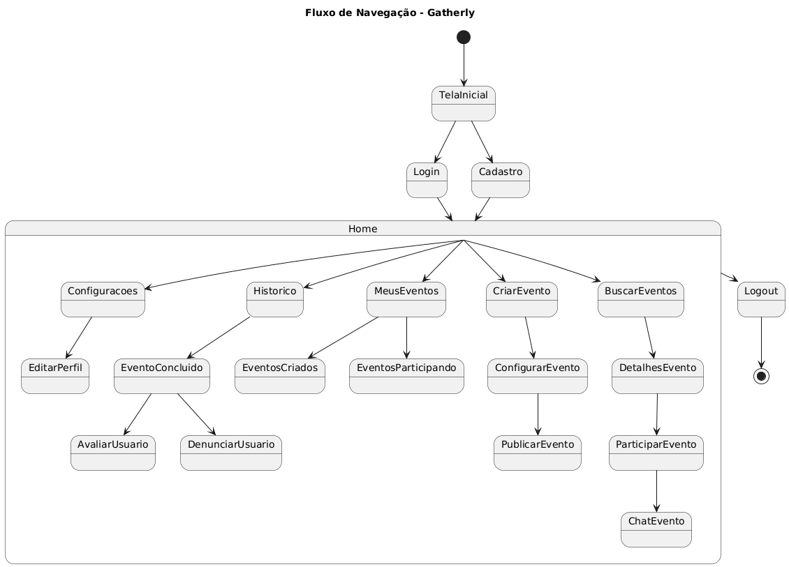

---

## 4.2 Wireframes ou Mockups das Telas

Nessa seção será mostrada os principais Mockups do sistema, assim como o que terá de funcionalidade para eles.

### Cadastro
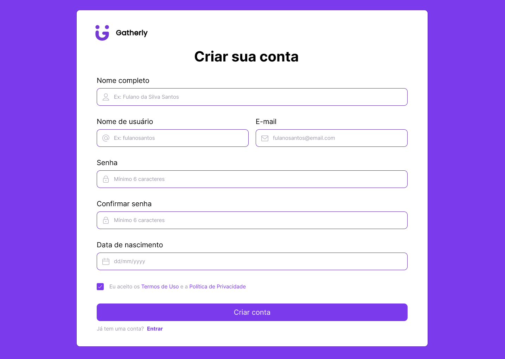

A imagem acima pertence a tela de cadastro do usuário, onde ele pode criar a conta para acessar as funcionalidades dentro do sistema. Para criar a conta basta apenas inserir algumas informações pessoais, como nome completo, email, data de nascimento e a senha que deseja utilizar no acesso ao sistema.

### Login
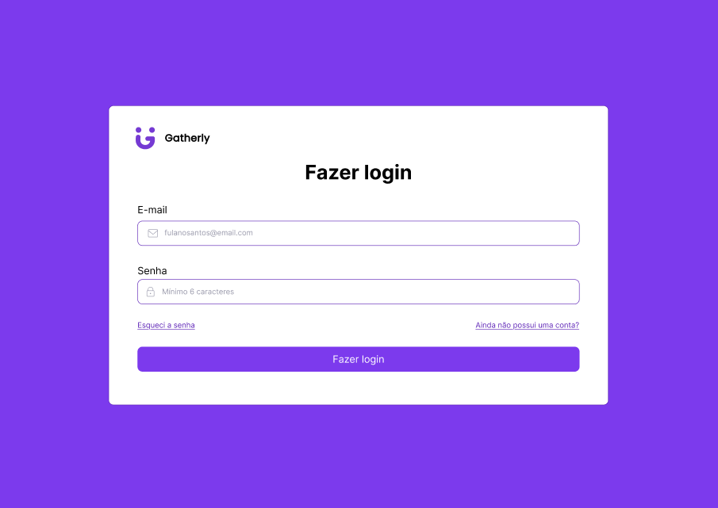

A tela de login permite o usuário a realizar o login no sistema, aproveitando as diversas funcionalidades que o sistema oferece.

### Homepage
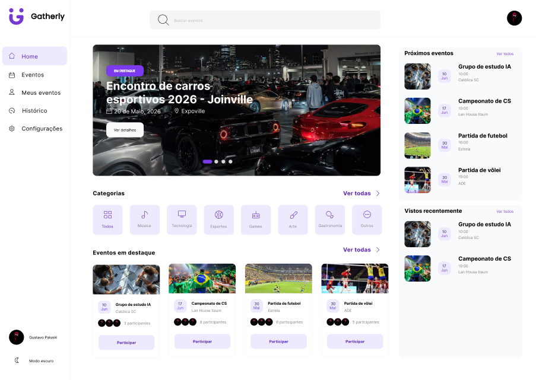

A homepage é a página principal do sistema, responsável por apresentar ao usuário um resumo dos eventos disponíveis e dos principais destaques para participação.

No lado esquerdo da tela, há um menu lateral que reúne as principais páginas do sistema, como a listagem de eventos, os eventos criados ou participados pelo usuário, o histórico de participações e a área de configurações.

Na região central da página, encontra-se um carrossel com os eventos em destaque, facilitando a visualização e o acesso rápido às principais opções disponíveis. Logo abaixo, estão as categorias, permitindo que o usuário realize filtros de acordo com seus interesses. Ainda na área central, também são exibidos os principais eventos em destaque da região do usuário.

No lado direito da tela, são apresentadas informações complementares para auxiliar a navegação. Entre elas, estão os eventos futuros ou próximos da data atual, funcionando como lembretes de participação, além da seção de eventos visualizados recentemente, facilitando o retorno rápido às páginas acessadas anteriormente.

### Eventos
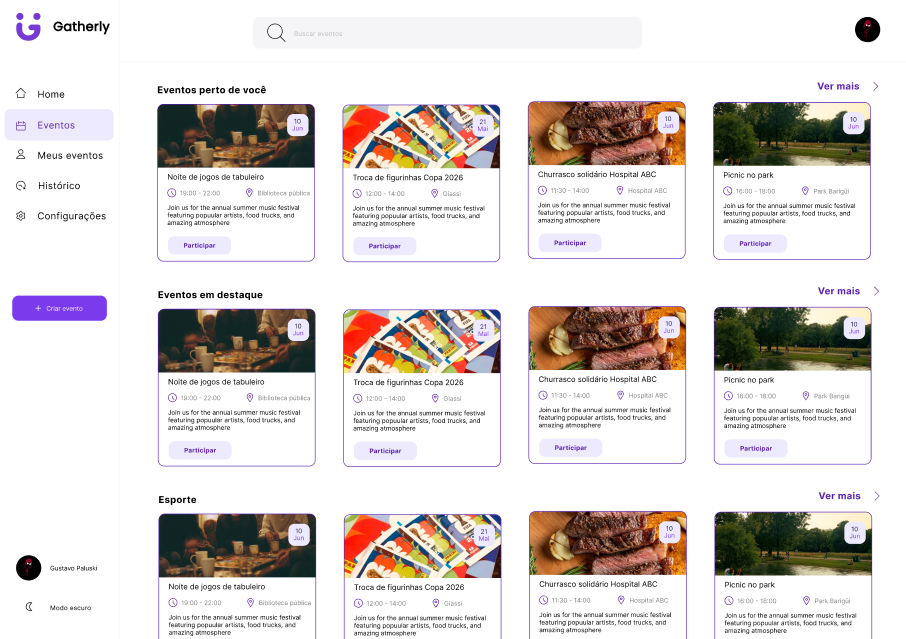

A imagem acima mostra a tela que mostra todos os eventos criados e ainda não iniciados, permitindo ao usuário escolher um para participar. Nela também consta uma barra de pesquisa para procurar o nome de um evento em específico, caso seja necessário.

Ao clicar em algum evento de interesse, ele será aberto em tela cheia, mostrando mais informações, como a localização e chat para conversas.

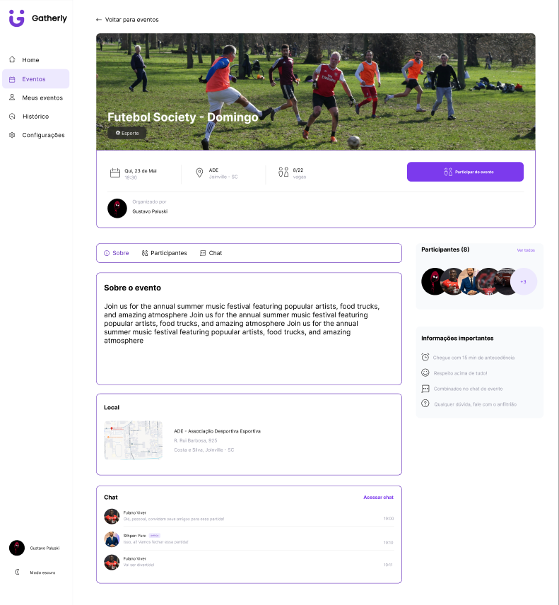

Voltando para a página de eventos, é possível apertar um botão roxo no menu lateral para criar os eventos, onde levará para a página de criação do evento, pedindo alguns informações necessáras para a criação.

### Criar evento
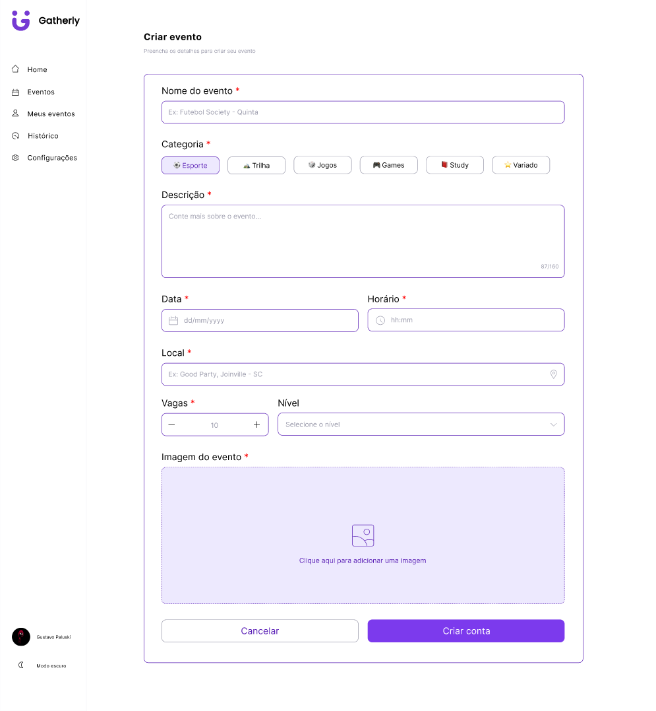

Para criar um evento basta colocar algumas informações nos campos pedidos, onde aqueles que tem o *asterisco* em vermelho indica que é um campo obrigatório.

Ao finalizar a criação, irá aparecer o evento para que outros usuários possam participar, indicando nas informações quem é o organizador e as informações necessárias para os interessados participarem.

### Meus eventos
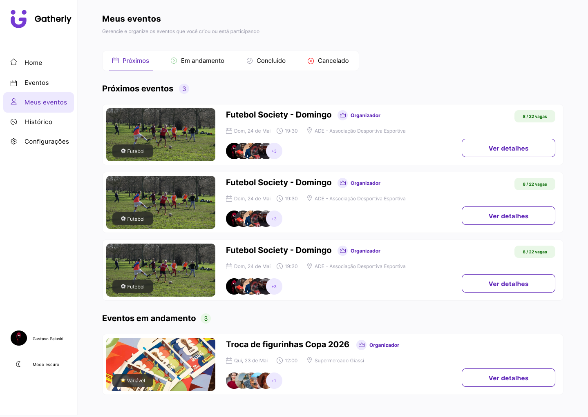

A página **"Meus eventos"** informa para o usuário os eventos que ele está participando, os que não começaram e ele se candidatou, os concluídos e os cancelados. Sendo possível ele utilizar o filtro de acordo com as preferências do usuário.

### Histórico
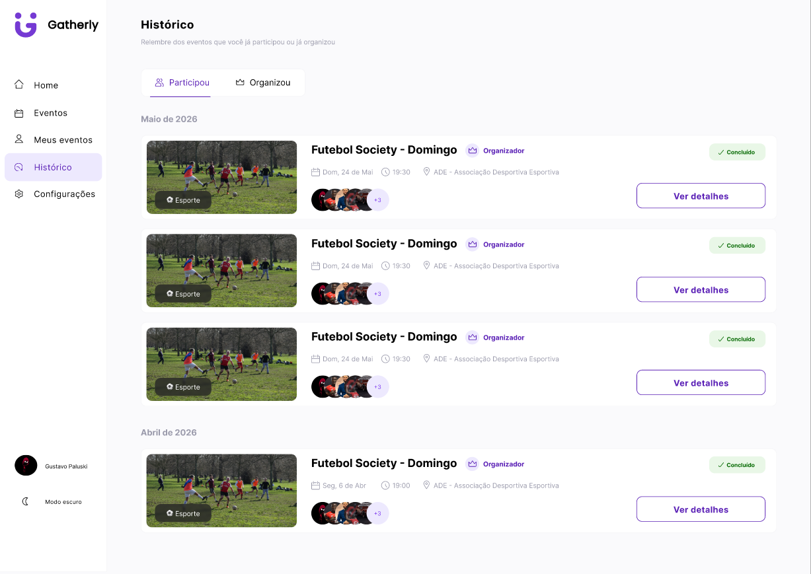

O histórico é bem parecido com a tela "meus eventos", mudando que ela só aparece os eventos que o usuário criou ou participou e que já tenha sido finalizado.

Nele também é possível filtrar entre eventos que ele participou e os que ele criou.

Ao acessar os que já estão finalizados, o usuário pode retornar ao evento e denunciar ou avaliar um usuário, através do filtro, dentro de um evento em específico.

### Participantes
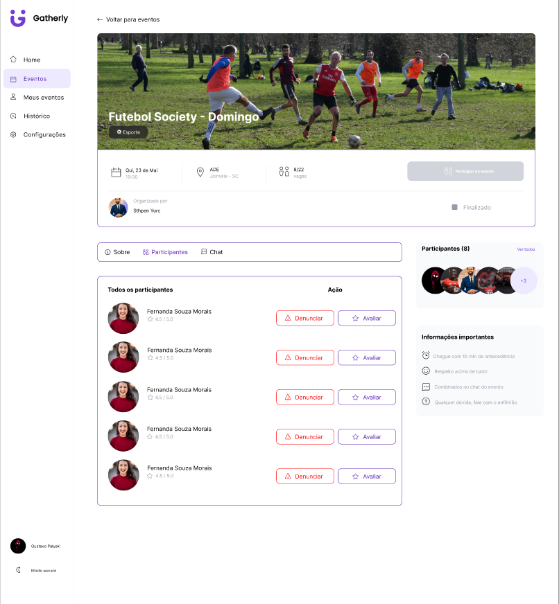

Os particiapentes aparecem no filtro de "Participantes", mostrando a foto, nome e a avaliação dele. Tendo também 2 botões, um permitindo os participantes do evento denunciar alguma ação ou ato que algum integrante cometeu. O outro botão permite ao usuário avaliar outro participante, sendo positivamente ou negativamente.

### Denunciar participante
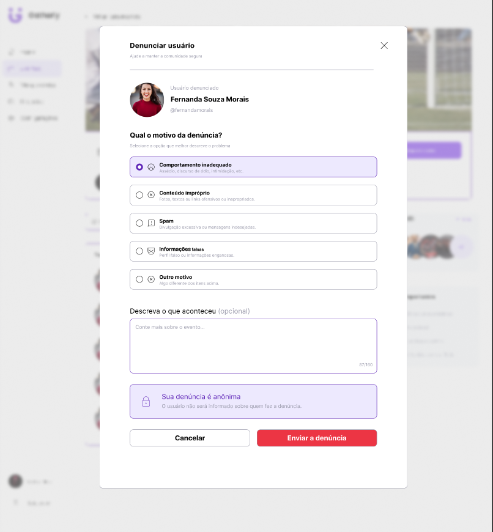

Ao clicar em denunciar um participante o modal de denúncia aparece, pedindo o motivo pelo qual a denúncia está sendo feita, e o campo opcional de texto, para dar mais detalhes para o responsável que irá avaliar a denúncia.

### Avaliar usuário
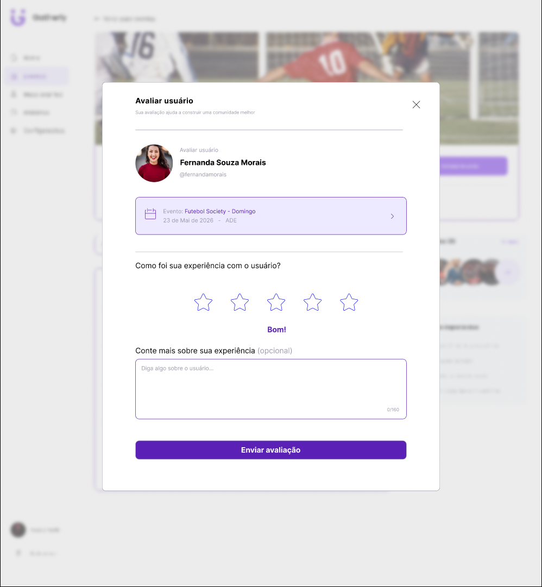

Assim como a denúncia de participante, a avaliação dele também é mostrada por meio de um modal, mostrando qual participante está sendo avaliado, de qual evento está sendo essa avaliação e a nota, em formato de estrelas, que deseja enviar.

### Retorno para o usuário
Após concluir uma ação, será mostrado para o usuário um aviso informando que a operação foi concluída com sucesso ou que algo deu errado, como mostra abaixo:

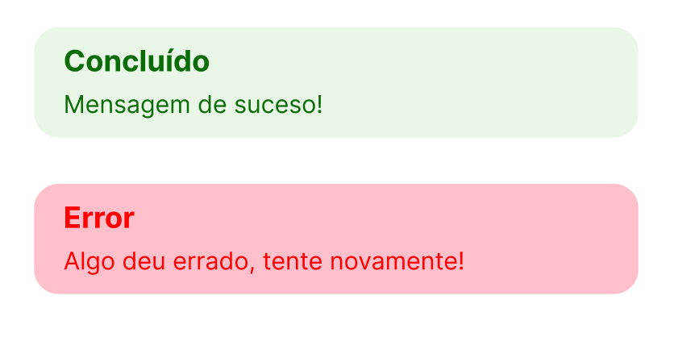

Um exemplo de retorno para o usuário, é a mensagem informando que o evento foi criado com sucesso:

### Link
Toda a parte de criação dos mockups foi realizado através da plataforma "Figma".
Link para acesso ao design: https://www.figma.com/design/EvgAtCGAUA9d0BuCmliouv/Gatherly?node-id=0-1&t=I1lSeSoxVVpX4jk4-1

---

## 4.3 Fluxo de Interação do Usuário

As imagens abaixo demonstram o passo a passo para participar de um evento, que é o fluxo pricipal do sistema. Nele vai ser demonstrado onde o usuário tem que seguir para poder se inscrever em um evento

### Fluxo: Participar de um evento

### Passo 1 - Acesso ao sistema

O usuário acessa a plataforma Gatherly por meio da tela inicial.

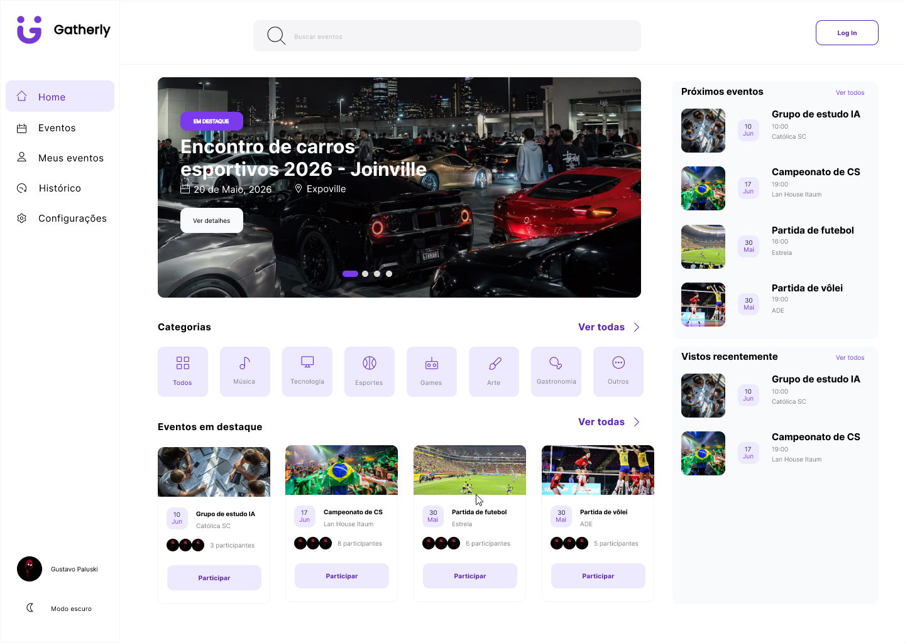

### Passo 2 - Autenticação

O usuário realiza login utilizando e-mail e senha.

### Passo 3 - Visualização dos eventos

Após autenticado, o sistema apresenta a lista de eventos disponíveis.

### Passo 4 - Seleção do evento

O usuário seleciona um evento para visualizar mais detalhes.

### Passo 5 - Participação no evento

O usuário clica no botão “Participar do evento”, se tiver vaga ele vai ser cadastrado, aparecendo a informação no canto inferior direito da página. Além do aviso o botão de participar do evento é desabilitado, visto que o usuário logado acabou de se inscrever no evento.

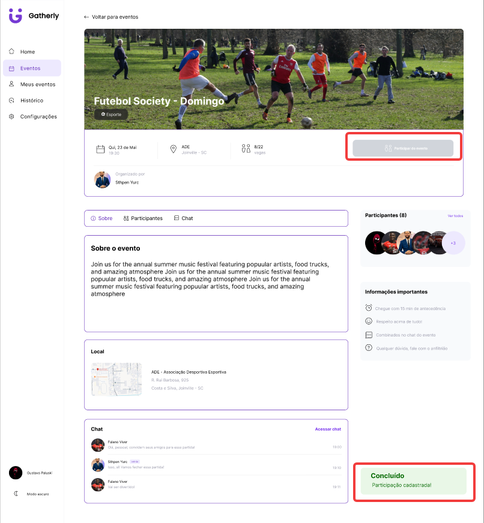

### Passo 6 - Evento concluído

Após o evento ser concluído, é possível o participante seguir para a página de histórico, onde ele vai encontar esse último evento participado, podendo conferir algumas informações, denunciar e avaliar os participantes presentes no evento.

### Passo 7 - Avaliação ou denúncia

O usuário pode avaliar participantes ou denunciar comportamentos inadequados.

---

# 5. Arquitetura do Sistema

---

## 5.1 Diagrama C4

## 1. Nível 1: Diagrama de Contexto

O diagrama de contexto representa a visão mais macro e abstrata do ecossistema do projeto, tendo como objetivo principal estabelecer as fronteiras do sistema e identificar como ele se posiciona em relação ao ambiente externo e aos seus usuários. Neste nível, o software é tratado como uma "caixa preta" centralizada, ocultando complexidades técnicas e focando exclusivamente nas jornadas e fluxos de valor do negócio. Para o Gatherly, o diagrama evidencia a interação de três atores essenciais com a plataforma: o Participante, que busca e confirma presença em programações locais; o Organizador, que cria e gerencia os eventos informais; e o Administrador, responsável pela moderação de usuários e análise de denúncias.

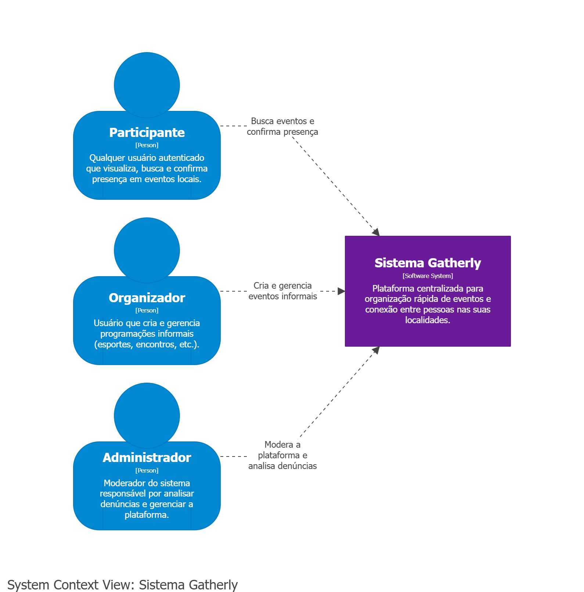

---

## 2. Nível 2: Diagrama de Containers

O diagrama de contêineres avança para o primeiro nível de detalhamento técnico do modelo C4, abrindo a caixa preta do sistema para ilustrar como a aplicação é dividida em unidades físicas de execução e armazenamento que podem ser implantadas de forma independente. Este nível descreve os limites de software, as tecnologias escolhidas para cada bloco e os protocolos de rede utilizados para a comunicação interna e externa da arquitetura cliente-servidor. No contexto do Gatherly, as personas de participante e organizador são tecnicamente unificadas em um único ator denominado Usuário Autenticado, refletindo a realidade física de que ambos interagem com a mesma aplicação cliente. O diagrama expõe a divisão do sistema em quatro grandes contêineres: a aplicação Web responsiva desenvolvida em Angular, a API Application responsável pelo processamento do back-end, o Realtime Chat Service baseado em WebSockets para a troca de mensagens instantâneas entre os confirmados nos eventos, e o Banco de Dados Relacional encarregado da persistência segura das informações. Trata-se de um mapa de infraestrutura de alto valor para engenheiros de software, desenvolvedores e administradores de sistemas, pois define o ambiente onde o ecossistema de software irá rodar.

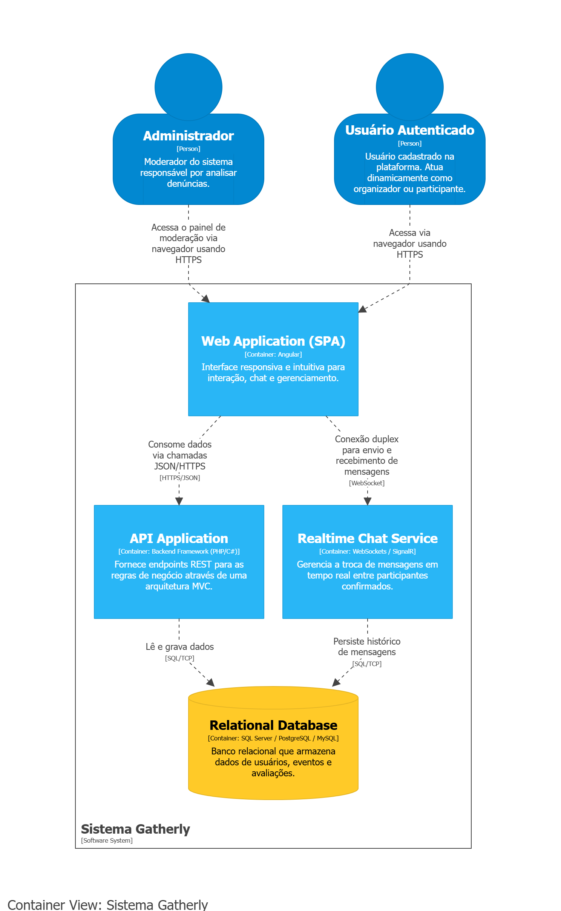

---

## 3. Nível 3: Diagrama de Componentes

O diagrama de componentes realiza um zoom profundo em um contêiner específico do sistema, para decompor sua estrutura interna em blocos de código logicamente acoplados e com responsabilidades bem delimitadas. Este nível detalha como os padrões arquiteturais de código e os requisitos não funcionais são estruturados para atender às regras de negócio estabelecidas na especificação do produto. No Gatherly, o diagrama demonstra uma arquitetura organizada em camadas bem definidas e baseada no padrão MVC. O fluxo se inicia nos componentes controladores de interface, como o AuthController, EventController, UserController e AdminController, que recebem e validam as requisições HTTP REST enviadas pelo front-end. Essas requisições são delegadas para a camada de serviços de negócio, composta pelo Auth Service, Event Service, Evaluation & Moderation Service e Notification Service, onde residem os algoritmos e regras críticas, como o controle de limite de vagas e o fluxo de denúncias de má conduta. Por fim, as operações de persistência e consulta são isoladas pela camada de acesso a dados (Data Access Layer), que se comunica diretamente com o banco de dados externo. Este nível funciona como o manual técnico definitivo para a equipe de desenvolvimento, mapeando com precisão a estrutura de diretórios e o fluxo de dependências que devem ser implementados no código-fonte.

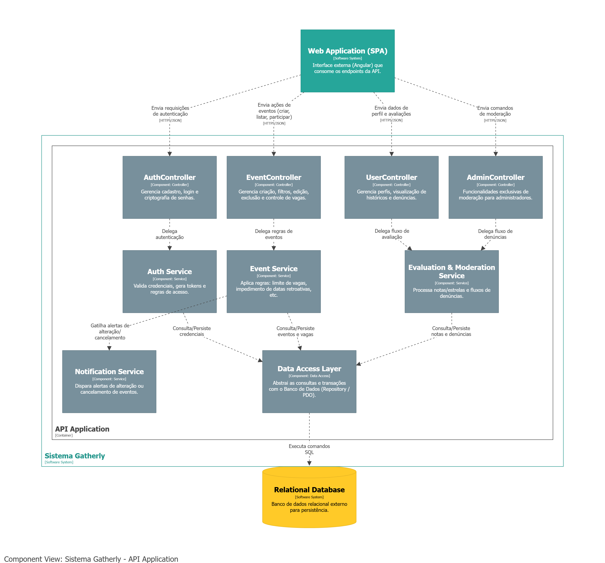

---

## 5.2 Modelo de Dados

### DER
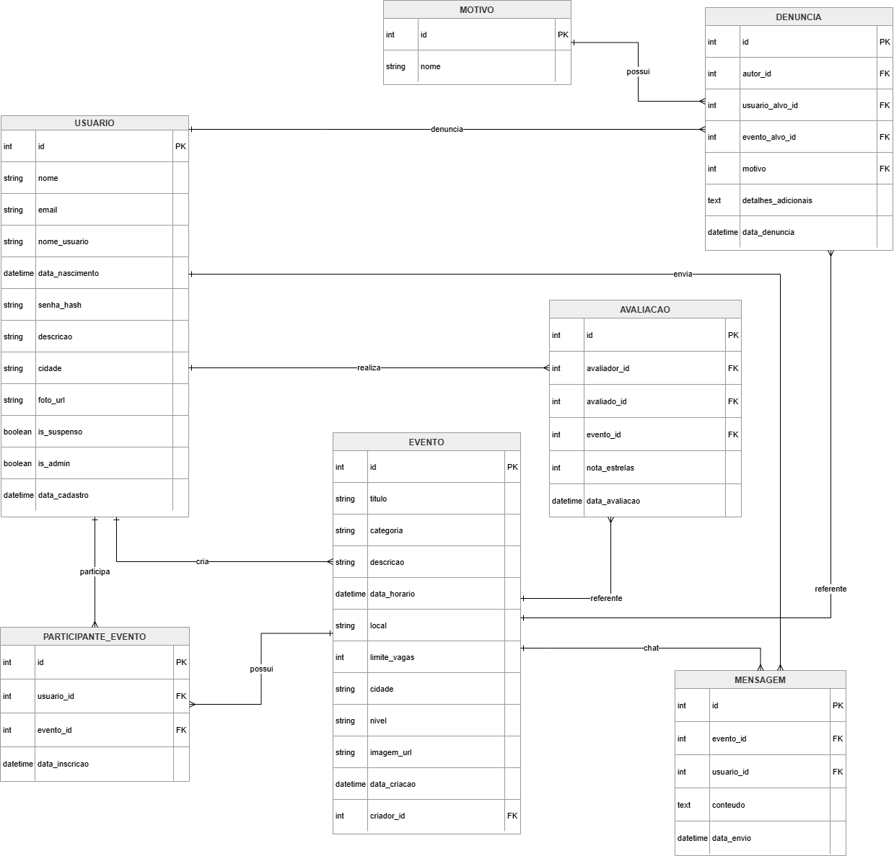

### Esquema relacional

### Usuário
| Campo | Tipo | Restrição        |
| :------- | :----: | ----------: |
| id_usuario | INT    | PK          |
| nome    |VARCHAR(100)| NOT NULL  |
| email   |VARCHAR(100)| UNIQUE |
| nome_usuario |VARCHAR(100)| NOT NULL |
| data_nascimento |DATETIME| NOT NULL |
| senha_hash | VARCHAR(255) | NOT NULL |
| descricao | VARCHAR(100) | NULL |
| cidade | VARCHAR(100) | NOT NULL |
| foto_url | VARCHAR(200) | NULL |
| is_suspenso | boolean | NOT NULL |
| is_admin | boolean | NOT NULL |
| data_cadastro | DATETIME | NOT NULL |

### Evento
| Campo | Tipo | Restrição        |
| :------- | :----: | ----------: |
| id_evento | INT    | PK          |
| titulo    |VARCHAR(100)| NOT NULL  |
| categoria |VARCHAR(100)| NOT NULL |
| descricao |VARCHAR(100)| NOT NULL |
| data_horario |DATETIME| NOT NULL |
| local | VARCHAR(255) | NOT NULL |
| limite_vagas | INT | NOT NULL |
| cidade | VARCHAR(100) | NOT NULL |
| nivel | VARCHAR(100) | NULL |
| imagem_url | VARCHAR(100) | NOT NULL |
| data_criacao | DATETIME | NOT NULL |
| criador_id | INT | FK |

### Participante_evento
| Campo | Tipo | Restrição        |
| :------- | :----: | ----------: |
|  id_participante_evento | INT    | PK |
| usuario_id | INT | FK |
| evento_id | INT | FK |
| data_inscricao | DATETIME | NOT NULL |

### Mensagem
| Campo | Tipo | Restrição        |
| :------- | :----: | ----------: |
|  id_mensagem | INT    | PK |
| evento_id | INT | FK |
| usuario_id | INT | FK |
| conteudo | VARCHARR(100) | NOT NULL |
| data_inscricao | DATETIME | NOT NULL |

### Avaliacao
| Campo | Tipo | Restrição        |
| :------- | :----: | ----------: |
|  id_avaliacao | INT    | PK |
| avaliador_id | INT | FK |
| avaliado_id | INT | FK |
| evento_id | INT | FK |
| nota_estrelas | INT | NOT NULL |
| data_avaliacao | DATETIME | NOT NULL |

### Denuncia
| Campo | Tipo | Restrição        |
| :------- | :----: | ----------: |
|  id_mensagem | INT    | PK |
| autor_id | INT | FK |
| usuario_alvo_id | INT | FK |
| evento_alvo_id | INT | FK |
| motivo | INT | FK |
| detalhes_adicionais | DATETIME | NULL |
| data_denuncia | DATETIME | NOT NULL |

### Motivo
| Campo | Tipo | Restrição        |
| :------- | :----: | ----------: |
|  id_motivo | INT    | PK |
| nome | VARCHAR(100) | NOT NULL |

---

## 5.3 Principais Componentes

### Interface Web (Frontend)
A interface web é responsável pela interação do usuário com o sistema. Por meio dela, os usuários conseguem realizar cadastro, login, visualizar eventos, criar eventos, participar de eventos, utilizar o chat e acessar funcionalidades relacionadas ao perfil. Esse componente foi desenvolvido para oferecer uma navegação intuitiva e facilitar a utilização da plataforma.

### API Backend
A API Backend é responsável pelo processamento das regras de negócio e pela comunicação entre o frontend e o banco de dados. Ela gerencia funcionalidades como autenticação de usuários, gerenciamento de eventos, controle de participantes, avaliações, denúncias e demais operações do sistema, garantindo o funcionamento correto da aplicação.

### Sistema de Autenticação
O sistema de autenticação é responsável pelo controle de acesso e segurança da plataforma. Esse componente realiza a validação das credenciais dos usuários durante o login, protege rotas privadas do sistema e garante que apenas usuários autenticados possam acessar determinadas funcionalidades.

### Módulo de Gerenciamento de Eventos
O módulo de gerenciamento de eventos é responsável pelas funcionalidades relacionadas aos eventos da plataforma. Por meio dele, os usuários podem criar, editar, cancelar e visualizar eventos, além de gerenciar participantes e acompanhar informações relacionadas às atividades cadastradas.

### Módulo de Chat
O módulo de chat permite a comunicação entre os participantes dos eventos. Esse componente possibilita a troca de mensagens em tempo real, promovendo maior interação social entre os usuários e facilitando a comunicação durante a participação nos eventos.

### Camada de Persistência
A camada de persistência é responsável pelo armazenamento e gerenciamento das informações do sistema no banco de dados. Esse componente garante o salvamento e recuperação de dados relacionados a usuários, eventos, mensagens, avaliações e denúncias, mantendo a integridade das informações da aplicação.

---

## 5.4 Stack Tecnológica

### Angular
Framework utilizado no desenvolvimento do frontend da aplicação. Foi escolhido por oferecer uma estrutura robusta para criação de interfaces modernas, componentizadas e organizadas.

### ASP.NET Core

Framework utilizado no backend da aplicação. Foi escolhido pela alta performance, segurança e facilidade na criação de APIs REST escaláveis.

### PostgreSQL

Banco de dados relacional escolhido pela confiabilidade, estabilidade e excelente suporte a relacionamentos entre tabelas.

### Entity Framework

ORM utilizado para facilitar a comunicação entre a aplicação e o banco de dados, permitindo manipulação dos dados de forma mais simples e produtiva.

### Figma

Ferramenta utilizada para criação dos protótipos das telas e planejamento visual da interface do sistema.

### Draw.io

Ferramenta utilizada para modelagem dos diagramas do sistema, como DER, fluxos de navegação e diagramas UML.

---

# 6. Segurança e Privacidade

A segurança da informação é um aspecto importante do Gatherly, visando proteger os dados dos usuários e garantir a confiabilidade da plataforma. Para isso, serão adotadas práticas recomendadas de desenvolvimento seguro, com foco na proteção contra vulnerabilidades conhecidas e no controle de acesso aos recursos do sistema.

**Proteção contra vulnerabilidades (OWASP Top 10)**

O sistema será desenvolvido seguindo as recomendações da OWASP Top 10, buscando prevenir vulnerabilidades comuns em aplicações web, como injeção de SQL, falhas de autenticação, exposição de dados sensíveis, controle inadequado de acesso e ataques de Cross-Site Scripting (XSS). A utilização do Entity Framework contribui para a mitigação de ataques de injeção de SQL por meio de consultas parametrizadas.

**Autenticação e Autorização**

O acesso às funcionalidades do sistema será controlado por mecanismos de autenticação baseados em credenciais de usuário. Após o login, o usuário receberá um token de acesso (JWT - JSON Web Token), utilizado para validar sua identidade nas requisições realizadas à API. Além disso, serão implementadas regras de autorização para garantir que cada usuário possa acessar apenas os recursos permitidos, como editar ou excluir apenas eventos criados por ele.

**Proteção de Dados Sensíveis**

As senhas dos usuários não serão armazenadas em texto puro no banco de dados. Para garantir sua proteção, será utilizado um algoritmo de hash seguro com salt. Além disso, a comunicação entre cliente e servidor deverá ocorrer por meio do protocolo HTTPS, garantindo a criptografia dos dados transmitidos pela rede.

**Privacidade dos Usuários**

O Gatherly armazenará apenas os dados necessários para o funcionamento da plataforma, respeitando os princípios de minimização de dados. Informações pessoais dos usuários serão utilizadas exclusivamente para fins relacionados à participação e gerenciamento de eventos, não sendo compartilhadas com terceiros sem consentimento.

**Controle de Acesso e Auditoria**

As operações realizadas pelos usuários poderão ser registradas por meio de logs da aplicação, permitindo o monitoramento de atividades relevantes e auxiliando na identificação de possíveis falhas ou tentativas de uso indevido do sistema.

---

## 6.1 Privacidade e LGPD

O Gatherly coleta apenas as informações necessárias para o funcionamento da plataforma e para a participação dos usuários nos eventos cadastrados.

### Dados Coletados

Durante o cadastro e utilização do sistema, poderão ser coletados os seguintes dados:

- Nome do usuário;
- Endereço de e-mail;
- Senha (armazenada de forma criptografada por meio de hash);
- Informações relacionadas aos eventos criados ou participados;
- Data e horário de acesso e utilização do sistema.

Esses dados são utilizados exclusivamente para autenticação, gerenciamento de contas, criação de eventos e controle da participação dos usuários na plataforma.

### Armazenamento dos Dados

Os dados serão armazenados em um banco de dados PostgreSQL hospedado em ambiente seguro. Informações sensíveis, como senhas, não serão armazenadas em texto puro, sendo protegidas por algoritmos de hash. Além disso, o acesso aos dados será restrito aos componentes autorizados da aplicação, seguindo boas práticas de segurança e controle de acesso.

### Remoção de Dados

O usuário poderá solicitar a exclusão de sua conta e dos dados pessoais associados por meio das configurações do sistema ou entrando em contato com os administradores da plataforma. Após a solicitação, os dados pessoais serão removidos ou anonimizados, desde que não exista obrigação legal ou necessidade técnica que exija sua manutenção temporária.

Essa abordagem busca atender aos princípios da privacidade e da proteção de dados, garantindo transparência sobre a coleta, armazenamento e exclusão das informações dos usuários.

---

# 7. Planejamento do Projeto

Defina os principais marcos de desenvolvimento.

| Marco | Descrição | Prazo |
|---|---|---|
| M1 | Setup do ambiente e prova de conceito | Semana X |
| M2 | MVP funcional | Semana Y |
| M3 | Testes e melhorias | Semana Z |

---

# 8. Referências

Tutorial do Diagrama de Sequência: Guia completo com exemplos. Disponível em: <https://creately.com/blog/pt/diagrama/tutorial-do-diagrama-de-sequencia/>. Acesso em: 31 maio. 2026.

Disponível em: <https://unsplash.com/pt-br/fotografias/closeup-photography-of-woman-smiling-mEZ3PoFGs_k>. Acesso em: 31 maio. 2026.

Disponível em: <https://unsplash.com/pt-br/fotografias/man-sitting-on-gray-concrete-wall-_M6gy9oHgII>. Acesso em: 31 maio. 2026b.

Disponível em: <https://unsplash.com/pt-br/fotografias/pessoa-vestindo-top-azul-sorrindo-j3lf-Jn6deo>. Acesso em: 31 maio. 2026c.

Disponível em: <https://unsplash.com/pt-br/fotografias/homem-na-camisa-branca-em-pe-perto-do-corpo-de-agua-durante-o-dia-4XK2oKKvzVU>. Acesso em: 31 maio. 2026d.

Disponível em: <https://unsplash.com/pt-br/fotografias/fotografia-de-foco-seletivo-da-mulher-com-fundo-marrom-da-parede-de-madeira-K_b41GaWC5Y>. Acesso em: 31 maio. 2026e.

---

# 9. Apêndices

Podem incluir:

- mockups adicionais
- resultados de pesquisa
- entrevistas com usuários
- diagramas complementares
- links para protótipos ou repositórios

Sempre que possível inclua **imagens, protótipos ou referências visuais**.

---

# 10. Parecer do Comitê de Avaliação

(A ser preenchido pelos professores)

**Avaliador 1:** __________________________  
**Status:** [ ] Aprovado  [ ] Ajustar

Observações:

---

**Avaliador 2:** __________________________  
**Status:** [ ] Aprovado  [ ] Ajustar

Observações:

---

**Avaliador 3:** __________________________  
**Status:** [ ] Aprovado  [ ] Ajustar

Observações: